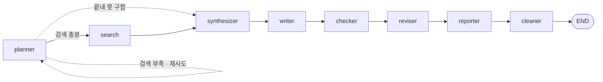

<h1 align="center">시장 브리핑 에이전트</h1>

<p align="center">
  증시 뉴스를 검색해 브리핑으로 정리하고, 근거 없는 문장을 걸러낸 뒤 디스코드로 보냅니다.
</p>

<p align="center">
  
  
  
  <a href="LICENSE"></a>
</p>

---

## 결과물

매일 아침 10시, 이런 브리핑이 디스코드로 도착합니다.

> ### 오늘 한눈에
> 미국 증시는 AI 관련 기술주가 오르면서 상승 마감했습니다. 7월 소비자물가지수가 예상보다 낮게 나와 연준이 금리를 동결할 거라는 전망이 늘었습니다.
>
> ### 미국 증시
> S&P 500은 0.3% 올라 7,748.50에 마감했고, 나스닥 종합지수도 0.54% 오른 26,588.49를 기록했습니다([Zacks](https://example.com), [Reuters](https://example.com)). 다만 다우존스 산업평균지수는 0.06% 내린 53,762.05로 마감해 지수마다 방향이 달랐습니다([TS2](https://example.com)).

문장마다 달린 인용은 LLM이 붙인 것이 아닙니다. 검색 원문과 대조해 근거가 확인된 문장에만 코드가 판정을 거쳐 삽입합니다.

## 빠른 시작

```bash
git clone https://github.com/rocknroll17/langgraph_news_agent.git
cd langgraph_news_agent
cp .env.example .env      # 키 채우기
uv sync
uv run python main.py
```

LLM은 OpenAI 호환 엔드포인트면 무엇이든 됩니다. `.env`의 `OPENAI_BASE_URL`만 바꾸면 됩니다.

```bash
TRACE=1 uv run python main.py     # 노드별로 뭐가 오갔는지
TRACE=full uv run python main.py  # 프롬프트·응답 전문
```

---

## 왜 노드를 나눴나

"검색 결과 읽고 브리핑 써줘"를 한 번에 시키면 잘 안 됩니다. 검색 원문 4~6건이 컨텍스트를 수만 토큰씩 차지한 상태에서 요약과 작문을 동시에 시키면, 원문 뒷부분을 흘리고 숫자를 틀리고 검색에 없던 내용을 만들어냅니다. 전형적인 **할루시네이션**이고, 모델이 작을수록 심합니다.

그래서 **한 노드가 한 가지 일만** 하게 나눴습니다.



| 노드 | 하는 일 | LLM |
|:--|:--|:-:|
| `planner` | 검색어를 한 번에 4~6개 만듭니다. 답은 쓰지 않습니다 | ● |
| `search` | `ToolNode`로 검색 tool_call을 병렬 팬아웃합니다 | |
| `synthesizer` | 원문에서 클레임을 추출하고 클레임 간 인과·대조를 표시합니다 | ● |
| `writer` | 추출된 클레임만으로 작문합니다. 검색 원문은 보지 않습니다 | ● |
| `checker` | 클레임을 원문 근거와 대조해 판정만 합니다 | ● |
| `reviser` | 판정에 따라 최소 편집으로 고치고 인용을 삽입합니다 | ● |
| `reporter` | 파일로 저장하고 디스코드로 보냅니다 | |
| `cleaner` | `RemoveMessage`로 상태를 비웁니다 | |

검색 원문을 직접 보는 노드는 `synthesizer` 하나뿐입니다. 뒷단으로 갈수록 컨텍스트가 가벼워집니다.

---

## 그라운딩 검증

`writer`가 쓴 글을 `checker`가 **클레임 단위로 분해**해 검색 원문 색인과 대조합니다. 판정은 NLI 방식의 3분류이고, Pydantic 스키마를 건 구조화 출력으로 받습니다.

| 판정 | 의미 | `reviser`의 처리 |
|:--|:--|:--|
| `SUPPORTED` | 원문이 그대로 뒷받침함 | 인용 삽입 |
| `CONTRADICTED` | 원문에 다른 값이 적혀 있음 | 해당 수치만 교체 후 인용 |
| `NOT_ENOUGH_INFO` | 원문에 근거가 없음 | 인용 없이 그대로 둠 |

실제로 잡히는 것:

```
[checker] 주장 16건 — 근거있음 9 / 어긋남 1 / 근거없음 6
   ✗ 다우존스 0.04% 하락 53,770.27  →  색인값: 0.06% 하락 53,762.05
   ✗ 상하이 종합지수 0.50% 하락      →  색인값: 0.32% 상승
```

판정과 교정을 나눈 이유는 한 번에 둘 다 시키면 양쪽 다 품질이 떨어지기 때문입니다. **클레임 분해 → 근거 인용 후 판정 → 최소 편집** 순서를 따릅니다.

_근거를 판정보다 먼저 쓰게 한 이유:_ 순서가 반대면 모델이 이미 내린 결론에 맞춰 근거를 지어냅니다.

---

## 설계 결정

### 가드레일은 프롬프트가 아니라 코드에

프롬프트에 써놔도 안 지켜지는 것들이 있습니다. 그런 건 코드에서 강제합니다.

| 문제 | 처리 |
|:--|:--|
| "최대 6회"라고 써도 더 부릅니다 | `tool_calls[:MAX_CALLS]`로 자릅니다 |
| 오래된 기사를 오늘 것처럼 씁니다 | Tavily `time_range="day"`로 고정합니다 |
| 모델이 `start_date`를 넣어 API가 400을 뱉습니다 | `query`만 받는 도구로 감쌉니다 |
| 출처 URL을 빠뜨리거나 바꿔 씁니다 | 검증 색인을 코드에서 만들어 주입합니다 |
| "없음"만 적힌 빈 섹션을 만듭니다 | 보내기 직전에 제목까지 지웁니다 |

### 데이터는 시스템 프롬프트에 넣지 않는다

시스템 메시지에는 역할과 규칙만 넣고, 실제 데이터는 `HumanMessage`로 줍니다.

_이유:_ 데이터를 시스템 프롬프트에 넣으면 모델이 그걸 few-shot 예시 자리로 해석해 "자료를 주세요"라고 되묻습니다. 시스템 프롬프트가 회차마다 고정되므로 프롬프트 캐싱에도 유리합니다.

### 어제 브리핑을 참고 자료로 붙인다

`reports/`에 쌓인 어제 브리핑을 `planner`에 `HumanMessage`로 붙입니다. 어제 다룬 이슈는 그 뒤 어떻게 됐는지 찾고, 어제 못 구한 항목은 다시 찾습니다.

_`AIMessage`가 아닌 이유:_ `AIMessage`로 붙이면 모델이 자기가 이미 답한 것으로 알고 검색을 건너뜁니다.

---

## 자동 실행

`.github/workflows/daily-briefing.yml`이 매일 10시(KST)에 돕니다. GitHub 러너가 그때만 켜졌다 꺼지니 서버를 따로 띄우지 않습니다.

만든 브리핑은 `reports/`에 커밋합니다. 러너는 매번 새 머신이라, 다음 회차의 `planner`가 어제 것을 읽으려면 저장소에 남아 있어야 합니다.

### 환경 분리

| 환경 | 트리거 | 채널 | `reports/` 커밋 |
|:--|:--|:--|:-:|
| `prod` | 스케줄 (매일 10시 KST) | 운영 | ● |
| `dev` | 수동 실행 기본값 | 시험 | ○ |

`dev`는 `DISCORD_WEBHOOK_URL`만 따로 갖고 나머지는 저장소 값을 씁니다. 시험 삼아 돌린 결과가 운영 채널로 나가거나 저장소에 커밋되지 않습니다.

수동 실행은 **Actions → 시장 브리핑 → Run workflow**에서 환경을 고릅니다.

### 등록할 값

**Settings → Secrets and variables → Actions**

| 종류 | 이름 |
|:--|:--|
| Variables | `OPENAI_BASE_URL`, `LOCAL_MODEL`, `LANGSMITH_PROJECT` |
| Secrets | `OPENAI_API_KEY`, `TAVILY_API_KEY`, `DISCORD_WEBHOOK_URL`, `LANGSMITH_API_KEY` |

**Settings → Environments → dev**

| 종류 | 이름 |
|:--|:--|
| Secrets | `DISCORD_WEBHOOK_URL` (시험 채널) |

---

## 프로젝트 구조

```
main.py              그래프 조립
config.py            모델·도구·상수
state.py             그래프 상태와 리듀서
nodes/
  base.py            Node / LLMNode 공통 골격
  <노드>/
    node.py          노드 로직
    prompts.py       프롬프트와 ChatPromptTemplate
utils/
  storage.py         reports/ 읽고 쓰기
  discord.py         웹훅 발송 (2,000자 분할, 429 재시도, 채널 여러 개)
  text.py            인용 색인 생성, 본문 정리
  trace.py           터미널 트레이스
```

프롬프트 조립용 빌더는 따로 만들지 않았습니다. LangChain의 `ChatPromptTemplate`이 그 역할을 합니다. 노드 폴더는 문구와 템플릿 정의만 갖고, 변수 치환과 모델 연결은 `template | model`이 처리합니다.

`TRACE=1` 출력은 이렇게 나옵니다.

```
▶ planner
  system    1,895자  당신은 리서치 팀의 리드입니다.…
  human       312자
      아래는 지난 브리핑입니다. …
◀ planner
  ai        도구 호출 5건
    🔧 search_news(query=S&P 500 Nasdaq Dow Jones close August 13 2026)
    🔧 search_news(query=STOXX 600 DAX FTSE 100 August 13 2026)
  🔧 search_news → 9,042자
  🔧 search_news → 11,199자

▶ synthesizer
  system    1,219자  당신은 리서치 팀의 리서처입니다.…
  tool      ×5  48,240자
◀ synthesizer
  ai        2,508자
      [미국 증시]
      - S&P 500 종가 7,748.50, +0.3% | Zacks, Reuters | https://…
```

---

## 기술 스택

| 영역 | 사용 |
|:--|:--|
| 오케스트레이션 | LangGraph (StateGraph, ToolNode, 조건부 엣지, 커스텀 리듀서) |
| LLM | OpenAI 호환 엔드포인트, tool calling, 구조화 출력 |
| 검색 | Tavily Search API |
| 관측 | LangSmith 트레이싱, 커스텀 `BaseCallbackHandler` |
| 실행 | uv, GitHub Actions |

## 라이선스

[MIT](LICENSE)
