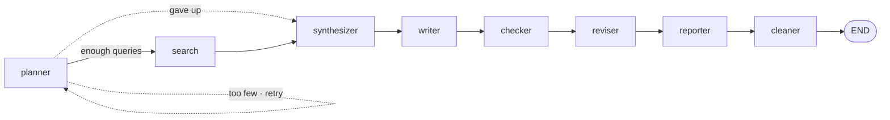

<h1 align="center">Market Briefing Agent</h1>

<p align="center">
  Searches market news, drafts a briefing, verifies every claim against the sources, and posts it to Discord.
</p>

<p align="center">
  
  
  
  <a href="LICENSE"></a>
</p>

## Highlights

- **Grounded output.** Every claim is decomposed and matched against the retrieved sources before publishing. Citations are inserted by code, not by the model.
- **Single-pass fan-out.** The planner emits all search queries in one turn and `ToolNode` runs them in parallel.
- **Runs on any model.** Point `OPENAI_BASE_URL` at any OpenAI-compatible endpoint, including a local one.
- **No server.** A scheduled GitHub Actions run does the work and shuts down.

## Example

> ### Today at a glance
> US equities closed higher as AI-related tech stocks rallied. July CPI came in below expectations, strengthening expectations that the Fed will hold rates steady.
>
> ### US markets
> The S&P 500 rose 0.3% to close at 7,748.50, and the Nasdaq Composite gained 0.54% to 26,588.49 ([Zacks](https://example.com), [Reuters](https://example.com)). The Dow Jones Industrial Average, however, slipped 0.06% to 53,762.05, leaving the major indices split ([TS2](https://example.com)).

## Installation

```bash
git clone https://github.com/rocknroll17/langgraph_news_agent.git
cd langgraph_news_agent
cp .env.example .env      # fill in your keys
uv sync
```

## Usage

```bash
uv run python main.py             # run once
TRACE=1 uv run python main.py     # print what each node sent and received
TRACE=full uv run python main.py  # print full prompts and responses
```

## How it works



| Node | Responsibility | LLM |
|:--|:--|:-:|
| `planner` | Emits 4–6 search queries in a single turn | ● |
| `search` | Fans the tool calls out in parallel via `ToolNode` | |
| `synthesizer` | Extracts claims from raw results and tags causal / contrastive links | ● |
| `writer` | Drafts prose from the extracted claims only | ● |
| `checker` | Matches each claim against the source index and judges it | ● |
| `reviser` | Applies minimal edits per verdict and inserts citations | ● |
| `reporter` | Saves to file and posts to Discord | |
| `cleaner` | Clears state for the next run | |

Verdicts follow the three-way NLI convention and come back as a Pydantic-typed structured output.

| Verdict | What `reviser` does |
|:--|:--|
| `SUPPORTED` | Insert citation |
| `CONTRADICTED` | Replace the figure with the source value, then cite |
| `NOT_ENOUGH_INFO` | Leave as is, no citation |

```
[checker] 16 claims — supported 9 / contradicted 1 / unsupported 6
   ✗ Dow down 0.04% at 53,770.27  →  index says: down 0.06% at 53,762.05
   ✗ Shanghai Composite down 0.50%  →  index says: up 0.32%
```

## Configuration

| Variable | Description |
|:--|:--|
| `OPENAI_BASE_URL` | Any OpenAI-compatible endpoint |
| `OPENAI_API_KEY` | Key for that endpoint |
| `LOCAL_MODEL` | Model id to send |
| `TAVILY_API_KEY` | [Tavily](https://tavily.com) search key |
| `DISCORD_WEBHOOK_URL` | Webhook URL. Comma-separate for multiple channels |
| `LANGSMITH_API_KEY` | Optional. Enables [LangSmith](https://smith.langchain.com) tracing |

## Scheduled runs

`.github/workflows/daily-briefing.yml` runs daily at 10:00 KST and commits each briefing to `reports/`, which the next run reads as context.

| Environment | Trigger | Channel | Commits |
|:--|:--|:--|:-:|
| `prod` | Schedule | Production | ● |
| `dev` | Default for manual runs | Staging | ○ |

Register the variables above as repository Secrets and Variables. The `dev` environment overrides `DISCORD_WEBHOOK_URL` only.

## Layout

```
main.py              graph assembly
config.py            model, tools, constants
state.py             graph state and reducers
nodes/<node>/        node.py (logic) + prompts.py (ChatPromptTemplate)
utils/               file I/O, Discord delivery, citation index, tracing
```

## License

[MIT](LICENSE)
